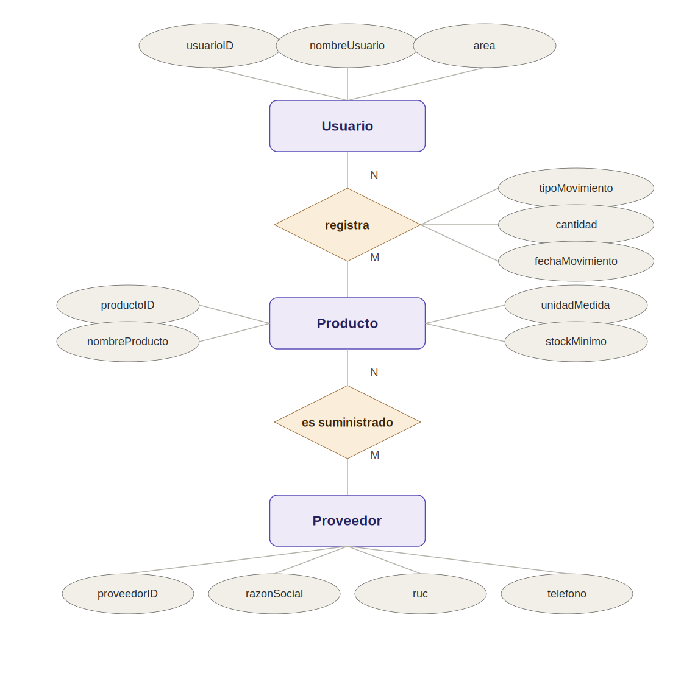
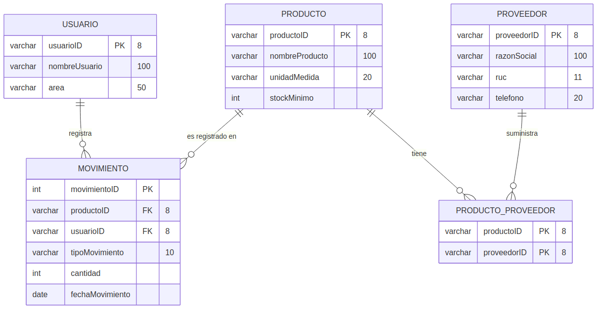
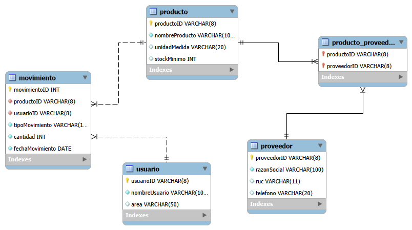

# Almacén de Laboratorio Clínico — Modelado y Diseño de Base de Datos (MySQL)

Proyecto desarrollado como entregable del Módulo 2 (SQL para Ingeniería de Datos) del programa Data Engineer. Consiste en el diseño e implementación de una base de datos relacional (OLTP) para controlar el inventario de un almacén de laboratorio clínico: registro de productos, proveedores, usuarios y movimientos de entrada/salida.

## Caso de uso

Un laboratorio clínico necesita controlar el inventario de reactivos e insumos médicos que utiliza a diario. El sistema debe permitir:

- Registrar productos (reactivos, insumos) con su stock mínimo.
- Registrar proveedores, considerando que un mismo producto puede ser abastecido por más de un proveedor.
- Registrar qué usuario del almacén ejecuta cada movimiento de inventario (entrada o salida), con fecha y cantidad.

## Modelado de datos

### Modelo Conceptual (Entidad-Relación)

3 entidades (`Usuario`, `Producto`, `Proveedor`) conectadas por 2 relaciones de muchos a muchos (N:M). La relación `registra` entre `Usuario` y `Producto` tiene atributos propios (tipo de movimiento, cantidad, fecha), por lo que se convierte en tabla en el modelo lógico.



### Modelo Lógico

Las relaciones N:M se transforman en las tablas puente `Producto_Proveedor` y `Movimiento`.



### Modelo Físico (MySQL)

Tipos de dato y restricciones exactas implementadas en el script.



## Estructura de la base de datos

| Tabla | Descripción |
|---|---|
| `Producto` | Reactivos e insumos del laboratorio |
| `Proveedor` | Proveedores que abastecen productos |
| `Usuario` | Personal del almacén que registra movimientos |
| `Producto_Proveedor` | Relación N:M entre productos y proveedores |
| `Movimiento` | Entradas y salidas de inventario (relación N:M con atributos) |

## Cómo ejecutar el script

1. Abrir MySQL Workbench (u otro cliente MySQL).
2. Ejecutar el archivo [`db_almacen_laboratorio_clinico.sql`](./db_almacen_laboratorio_clinico.sql) completo.
3. Esto crea la base de datos `almacen_laboratorio_clinico`, las 5 tablas con sus llaves primarias/foráneas, y carga datos de ejemplo para poder hacer consultas de prueba de inmediato.

```sql
-- Ejemplo de consulta de prueba
SELECT p.nombreProducto, m.tipoMovimiento, m.cantidad, m.fechaMovimiento, u.nombreUsuario
FROM Movimiento m
JOIN Producto p ON m.productoID = p.productoID
JOIN Usuario u ON m.usuarioID = u.usuarioID
ORDER BY m.fechaMovimiento;
```

## Tecnologías

- MySQL 8.0
- MySQL Workbench

## Autor

Kevin Steven Reyes Morocho 
www.linkedin.com/in/kevin-steven-reyes-morocho-
